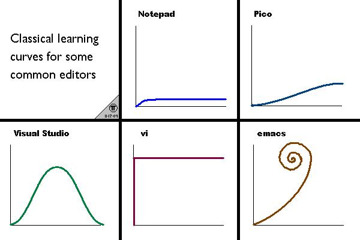

```{r}

```

#Vi in Linux
- Open: vi
- Close: :q
- force close: :q!

# Vi Mode in RStudio
## Modi
Normal Mode
Insert Mode

##Navigation in normal mode
L or right arrow Right one character
H or left arrow Left one character
J or down arrow Down one line
K or up arrow Up one line

w beginning of the next word
b beginning of the word or previous word

$ Jump to the end of a line
0 Jump to the beginning of a line
"#G" jump to # line 

G jump to end of the file
gg jump to the beginning of the file

% jump to machhting character
f_ jump to next occurence of _ in the same line


##Textmaipulation within normal mode
di_ delet inner _
dd delete line
x de character

## Editing
r relace a simgle character
cc
ci_ change inner _

## Navigate and switch to insert
i Insertmode bevor curser
a Insertmode afert curser
I Insertmode at line start
A Insertmode at line End
o Insertmode in line below
O Insertmode in line above


# Various
zz move screen to center cursor
crtl+B Page up 
crtl+F Page down
za fold code

```{r}
a <- c(1,2,3,4)
for(n in a){
 print(n*5) 
 
}
```

# Use with caution or not usefull in RStudio

v switch to visual mode
y yank

p insert cache after curser
P inser cach befor curser

u undo
crtl+r redo

/_ find _ in file

:w save
:q quite
:wq save and quite
:q! forcequit


# Final Remark  s

- Integrated into other editors
- Powerfull, and adjustable --> vimrc


#Citations
- Chaper 12 of the Linux command line
- https://vim.rtorr.com/