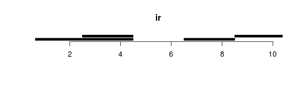
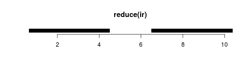
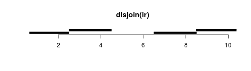

work with range data
========================================================
author: 
date: 
autosize: true


Packages
========================================================
http://kasperdanielhansen.github.io/genbioconductor/
- **IRanges**  
Used to implement data structure for generic ranges and sequences
- **GenomicRanges**  
Used to represent and work with genomic ranges;   
extend IRanges by handling biological details like chromosome name and strand
- **GenomicFeatures**  
Used to represent and work with ranges that represent gene models and other features of a genome (genes, exons, UTRs, transcripts, etc.)
- **Biostrings** and **BSgenome**  
Used for manipulating genomic sequence data in R
- **rtracklayer**  
Used for reading in common bioinformatics formats like BED, GTF/GFF, and WIG.


Overview
=================================================================

A surprising amount of objects/tasks in computational biology can be formulated in terms of integer intervals, manipulation of integer intervals and overlap of integer intervals.

**Objects**: A transcript (a union of integer intervals), a collection of SNPs (intervals of width 1), transcription factor binding sites, a collection of aligned short reads.

**Tasks**: Which transcription factor binding sites hit the promoter of genes (overlap between two sets of intervals), which SNPs hit a collection of exons, which short reads hit a predetermined set of exons.

`IRanges` are collections of integer intervals.  `GRanges` are like `IRanges`, but with an associated chromosome and strand, taking care of some book keeping.

Here we discuss `IRanges`, which provides the foundation for `GRanges`.  This package implements (amongst other things) an algebra for handling integer intervals.


Basic IRanges
=======================================================
**Specify IRanges by 2 of start, end, width (SEW).**  
IRanges(start=NULL, end=NULL, width=NULL, names=NULL)

```r
library(IRanges) 
ir1 <- IRanges(start = c(1,3,5), end = c(3,5,7))
ir1
```

```
IRanges object with 3 ranges and 0 metadata columns:
          start       end     width
      <integer> <integer> <integer>
  [1]         1         3         3
  [2]         3         5         3
  [3]         5         7         3
```

```r
ir2 <- IRanges(start = c(1,3,5), width = 3)
all.equal(ir1, ir2)
```

```
[1] TRUE
```

An `IRanges` consist of separate intervals; each interval is called a range.  So `ir1` above contains 3 ranges.


Basic IRanges
===========================================================================
Assessor methods: `start()`, `end()`, `width()` and also replacement methods.

```r
start(ir1)
```

```
[1] 1 3 5
```

```r
width(ir2) <- 1
ir2
```

```
IRanges object with 3 ranges and 0 metadata columns:
          start       end     width
      <integer> <integer> <integer>
  [1]         1         1         1
  [2]         3         3         1
  [3]         5         5         1
```

They may have names

```r
names(ir1) <- paste("A", 1:3, sep = "")
ir1
```

```
IRanges object with 3 ranges and 0 metadata columns:
         start       end     width
     <integer> <integer> <integer>
  A1         1         3         3
  A2         3         5         3
  A3         5         7         3
```

Basic IRanges
===========================================================================
They have a single dimension

```r
dim(ir1)
```

```
NULL
```

```r
length(ir1)
```

```
[1] 3
```

Because of this, subsetting works like a vector

```r
ir1[1]
```

```
IRanges object with 1 range and 0 metadata columns:
         start       end     width
     <integer> <integer> <integer>
  A1         1         3         3
```

```r
ir1["A1"]
```

```
IRanges object with 1 range and 0 metadata columns:
         start       end     width
     <integer> <integer> <integer>
  A1         1         3         3
```

Like vectors, you can concatenate two `IRanges` with the `c()` function

```r
c(ir1, ir2)
```

```
IRanges object with 6 ranges and 0 metadata columns:
         start       end     width
     <integer> <integer> <integer>
  A1         1         3         3
  A2         3         5         3
  A3         5         7         3
             1         1         1
             3         3         1
             5         5         1
```

Normal IRanges
====================================================================
A normal IRanges is a minimal representation of the IRanges viewed as a set.  
Each integer only occur in a single range and there are as few ranges as possible.  
In addition, it is ordered.  
Many functions produce a normal `IRanges`.  Created by `reduce()`.


```r
ir <- IRanges(start = c(1,3,7,9), end = c(4,4,8,10))
```





Disjoin:
From some perspective, `disjoin()` is the opposite of `reduce()`. 


Manipulating IRanges, intra-range
=========================================================================
"Intra-range" manipulations are manipulations where each original range gets mapped to a new range.

Examples of these are: `shift()`, `narrow()`, `flank()`, `resize()`, `restrict()`.

For example, `resize()` can be extremely useful.  It has a `fix` argument controlling where the resizing occurs from.  Use `fix="center"` to resize around the center of the ranges.


```r
resize(ir, width = 5, fix = "start")
```

```
IRanges object with 4 ranges and 0 metadata columns:
          start       end     width
      <integer> <integer> <integer>
  [1]         1         5         5
  [2]         3         7         5
  [3]         7        11         5
  [4]         9        13         5
```

```r
resize(ir, width = 5, fix = "center")
```

```
IRanges object with 4 ranges and 0 metadata columns:
          start       end     width
      <integer> <integer> <integer>
  [1]         0         4         5
  [2]         1         5         5
  [3]         5         9         5
  [4]         7        11         5
```

The help page is `?"intra-range-methods"`.

Manipulating IRanges, as sets
==========================================================================
Manipulating `IRanges` as sets means that we view each `IRanges` as a set of integers; individual integers is either contained in one or more ranges or they are not.  This is equivalent to calling `reduce()` on the `IRanges` first.

Once this is done, we can use standard: `union()`, `intersect()`, `setdiff()`, `gaps()` between two `IRanges` (which all returns normalized `IRanges`).


```r
ir1 <- IRanges(start = c(1, 3, 5), width = 1)
ir2 <- IRanges(start = c(4, 5, 6), width = 1)
union(ir1, ir2)
```

```
IRanges object with 2 ranges and 0 metadata columns:
          start       end     width
      <integer> <integer> <integer>
  [1]         1         1         1
  [2]         3         6         4
```

```r
intersect(ir1, ir2)
```

```
IRanges object with 1 range and 0 metadata columns:
          start       end     width
      <integer> <integer> <integer>
  [1]         5         5         1
```

Because they return normalized `IRanges`, an alternative to `union()` is

```r
reduce(c(ir1, ir2))
```

```
IRanges object with 2 ranges and 0 metadata columns:
          start       end     width
      <integer> <integer> <integer>
  [1]         1         1         1
  [2]         3         6         4
```

There is also an element-wise (pair-wise) version of these: `punion()`, `pintersect()`, `psetdiff()`, `pgap()`; this is similar to say `pmax` from base R. These functions are seldom used.


Finding Overlaps
==========================================================================
Finding (pairwise) overlaps between two `IRanges` is done by `findOverlaps()`.  This function is very important and amazingly fast!


```r
ir1 <- IRanges(start = c(1,4,8), end = c(3,7,10))
ir2 <- IRanges(start = c(3,4), width = 3)
ov <- findOverlaps(ir1, ir2)
ov
```

```
Hits object with 3 hits and 0 metadata columns:
      queryHits subjectHits
      <integer>   <integer>
  [1]         1           1
  [2]         2           1
  [3]         2           2
  -------
  queryLength: 3 / subjectLength: 2
```

It returns a `Hits` object which describes the relationship between the two `IRanges`.  This object is basically a two-column matrix of indicies into the two `IRanges`.

The two columns of the hits object can be accessed by `queryHits()` and `subjectHits()` (often used with `unique()`).

For example, the first row of the matrix describes that the first range of `ir1` overlaps with the first range of `ir2`. 

Finding Overlaps
==========================================================================
The elements of `unique(queryHits)` gives you the indices of the query ranges which actually had an overlap; you need `unique` because a query range may overlap multiple subject ranges.


```r
queryHits(ov)
```

```
[1] 1 2 2
```

```r
unique(queryHits(ov))
```

```
[1] 1 2
```

The list of arguments to `findOverlaps()` is long; there are a few hidden treasures here. For example, you can ask to only get an overlap if two ranges overlap by a certain number of bases.


```r
args(findOverlaps)
```

```
function (query, subject, maxgap = -1L, minoverlap = 0L, type = c("any", 
    "start", "end", "within", "equal"), select = c("all", "first", 
    "last", "arbitrary"), ...) 
NULL
```

countOverlaps
==========================================================
For efficiency, there is also `countOverlaps()`, which just returns the number of overlaps.     
This function is faster and takes up less memory because it does not have to keep track of which ranges overlap, just the number of overlaps.


```r
countOverlaps(ir1, ir2)
```

```
[1] 1 2 0
```


Finding nearest IRanges
=========================================================
Sometimes you have two sets of `IRanges` and you need to know which ones are closest to each other.  Functions for this include `nearest()`, `precede()`, `follow()`.  Watch out for ties!


```r
ir1
```

```
IRanges object with 3 ranges and 0 metadata columns:
          start       end     width
      <integer> <integer> <integer>
  [1]         1         3         3
  [2]         4         7         4
  [3]         8        10         3
```

```r
ir2
```

```
IRanges object with 2 ranges and 0 metadata columns:
          start       end     width
      <integer> <integer> <integer>
  [1]         3         5         3
  [2]         4         6         3
```

```r
nearest(ir1, ir2)
```

```
[1] 1 1 2
```


GRanges
=======================================================
Because GenomicRanges extends IRanges, everything in the previous sections can be directly applied to the genomic version of an IRanges object, GRanges.   

None of the function names nor behaviors differ much, besides two added
complications: dealing with multiple chromosomes and strand.

```r
library(GenomicRanges)
seqlens <- c(chr1=152, chr2=432, chr3=903)
gr <- GRanges(seqname=c("chr1", "chr1", "chr2", "chr3"),
              ranges=IRanges(start=5:8, width=10),
              strand=c("+", "-", "-", "+"),
              gc=round(runif(4), 3),
              seqlengths=seqlens)
gr
```

```
GRanges object with 4 ranges and 1 metadata column:
      seqnames    ranges strand |        gc
         <Rle> <IRanges>  <Rle> | <numeric>
  [1]     chr1      5-14      + |     0.534
  [2]     chr1      6-15      - |     0.431
  [3]     chr2      7-16      - |     0.721
  [4]     chr3      8-17      + |     0.388
  -------
  seqinfo: 3 sequences from an unspecified genome
```

This illustrates the structure of GRanges objects: genomic location specified by
sequence name, range, and strand (on the left of the dividing bar), and metadata col‐
umns (on the right). Each row of metadata corresponds to a range on the same row.
All metadata attached to a GRanges object are stored in a DataFrame , which behaves
identically to R’s base data.frame , but supports a wider variety of column types. For
example, DataFrames allow for run-length encoded vectors to save memory (whereas
R’s base data.frame does not).

GRanges
=======================================================
Natural accessor functions: `strand()`, `seqnames()`, `ranges()`, `start()`, `end()`, `width()`.

Because the have strand, we now have operations which are relative to the direction of transcription (`upstream()`, `downstream()`):


```r
gr
```

```
GRanges object with 4 ranges and 1 metadata column:
      seqnames    ranges strand |        gc
         <Rle> <IRanges>  <Rle> | <numeric>
  [1]     chr1      5-14      + |     0.534
  [2]     chr1      6-15      - |     0.431
  [3]     chr2      7-16      - |     0.721
  [4]     chr3      8-17      + |     0.388
  -------
  seqinfo: 3 sequences from an unspecified genome
```

```r
flank(gr, 2, start = FALSE)
```

```
GRanges object with 4 ranges and 1 metadata column:
      seqnames    ranges strand |        gc
         <Rle> <IRanges>  <Rle> | <numeric>
  [1]     chr1     15-16      + |     0.534
  [2]     chr1       4-5      - |     0.431
  [3]     chr2       5-6      - |     0.721
  [4]     chr3     18-19      + |     0.388
  -------
  seqinfo: 3 sequences from an unspecified genome
```

GRanges: metadata
===========================================================================
`GRanges` (unlike `IRanges`) may have associated metadata.  This is immensely useful.  The formal way to access and set this metadata is through `values` or `elementMetadata` or `mcols`, like

```r
values(gr)
```

```
DataFrame with 4 rows and 1 column
         gc
  <numeric>
1     0.534
2     0.431
3     0.721
4     0.388
```

```r
elementMetadata(gr)
```

```
DataFrame with 4 rows and 1 column
         gc
  <numeric>
1     0.534
2     0.431
3     0.721
4     0.388
```

```r
mcols(gr)
```

```
DataFrame with 4 rows and 1 column
         gc
  <numeric>
1     0.534
2     0.431
3     0.721
4     0.388
```

```r
# this returns a DataFrame object
mcols(gr)$gc
```

```
[1] 0.534 0.431 0.721 0.388
```

```r
# we could easily compute the average GC content of all ranges on chr1
mean(mcols(gr[seqnames(gr) == "chr1"])$gc)
```

```
[1] 0.4825
```

```r
# A much easier way to set and access metadata is through the `$` operator
gr$gc
```

```
[1] 0.534 0.431 0.721 0.388
```

```r
gr$gc2 = gr$gc * 0.2
gr
```

```
GRanges object with 4 ranges and 2 metadata columns:
      seqnames    ranges strand |        gc       gc2
         <Rle> <IRanges>  <Rle> | <numeric> <numeric>
  [1]     chr1      5-14      + |     0.534    0.1068
  [2]     chr1      6-15      - |     0.431    0.0862
  [3]     chr2      7-16      - |     0.721    0.1442
  [4]     chr3      8-17      + |     0.388    0.0776
  -------
  seqinfo: 3 sequences from an unspecified genome
```

DataFrame
================================================================
The `S4Vectors` package introduced the `DataFrame` class.  This class is very similar to the base `data.frame` class from R, but it allows columns of any class, provided a number of required methods are supported.  For example, `DataFrame` can have `IRanges` as columns, unlike `data.frame`:


```r
ir <- IRanges(start = 1:2, width = 3)
df1 <- DataFrame(iranges = ir)
df1
```

```
DataFrame with 2 rows and 1 column
    iranges
  <IRanges>
1       1-3
2       2-4
```

```r
df1$iranges
```

```
IRanges object with 2 ranges and 0 metadata columns:
          start       end     width
      <integer> <integer> <integer>
  [1]         1         3         3
  [2]         2         4         3
```

```r
df2 <- data.frame(iranges = ir)
df2
```

```
  iranges.start iranges.end iranges.width
1             1           3             3
2             2           4             3
```

In the `data.frame` case, the `IRanges` gives rise to 4 columns, whereas it is a single column when a `DataFrame` is used.

Think of this as an expanded and more versatile class.


GRanges: findOverlaps
====================================================================
`findOverlaps` works exactly as for `IRanges`.  But the `strand` information can be confusing.  Let us make an example


```r
gr2 <- GRanges(seqnames = c("chr1", "chr2", "chr1"), strand = "*",
               ranges = IRanges(start = c(1, 3, 5), width = 3))
gr
```

```
GRanges object with 4 ranges and 2 metadata columns:
      seqnames    ranges strand |        gc       gc2
         <Rle> <IRanges>  <Rle> | <numeric> <numeric>
  [1]     chr1      5-14      + |     0.534    0.1068
  [2]     chr1      6-15      - |     0.431    0.0862
  [3]     chr2      7-16      - |     0.721    0.1442
  [4]     chr3      8-17      + |     0.388    0.0776
  -------
  seqinfo: 3 sequences from an unspecified genome
```

```r
gr2
```

```
GRanges object with 3 ranges and 0 metadata columns:
      seqnames    ranges strand
         <Rle> <IRanges>  <Rle>
  [1]     chr1       1-3      *
  [2]     chr2       3-5      *
  [3]     chr1       5-7      *
  -------
  seqinfo: 2 sequences from an unspecified genome; no seqlengths
```


```r
findOverlaps(gr, gr2)
```

```
Hits object with 2 hits and 0 metadata columns:
      queryHits subjectHits
      <integer>   <integer>
  [1]         1           3
  [2]         2           3
  -------
  queryLength: 4 / subjectLength: 3
```

Notice how the `*` strand overlaps both `+` and `-`.  There is an argument `ignore.strand` to `findOverlaps` which will ... ignore the strand information (so `+` overlaps `-`). Several other functions in `GenomicRanges` have an `ignore.strand` argument as well. 


subsetByOverlaps
==========================================================================
A common operation is to select only certain ranges from a `GRanges` which overlap something else.  Enter the convenience function `subsetByOverlaps`

```r
gr
```

```
GRanges object with 4 ranges and 2 metadata columns:
      seqnames    ranges strand |        gc       gc2
         <Rle> <IRanges>  <Rle> | <numeric> <numeric>
  [1]     chr1      5-14      + |     0.534    0.1068
  [2]     chr1      6-15      - |     0.431    0.0862
  [3]     chr2      7-16      - |     0.721    0.1442
  [4]     chr3      8-17      + |     0.388    0.0776
  -------
  seqinfo: 3 sequences from an unspecified genome
```

```r
gr2
```

```
GRanges object with 3 ranges and 0 metadata columns:
      seqnames    ranges strand
         <Rle> <IRanges>  <Rle>
  [1]     chr1       1-3      *
  [2]     chr2       3-5      *
  [3]     chr1       5-7      *
  -------
  seqinfo: 2 sequences from an unspecified genome; no seqlengths
```

```r
subsetByOverlaps(gr, gr2)
```

```
GRanges object with 2 ranges and 2 metadata columns:
      seqnames    ranges strand |        gc       gc2
         <Rle> <IRanges>  <Rle> | <numeric> <numeric>
  [1]     chr1      5-14      + |     0.534    0.1068
  [2]     chr1      6-15      - |     0.431    0.0862
  -------
  seqinfo: 3 sequences from an unspecified genome
```

makeGRangesFromDataFrame
=======================================================================
A common situation is that you have data which looks like a `GRanges` but is really stored as a classic `data.frame`, with `chr`, `start` etc.  The `makeGRangesFromDataFrame` converts this `data.frame` into a `GRanges`.  An argument tells you whether you want to keep any additional columns.


```r
df <- data.frame(chr = "chr1", start = 1:3, end = 4:6, score = 7:9)
makeGRangesFromDataFrame(df)
```

```
GRanges object with 3 ranges and 0 metadata columns:
      seqnames    ranges strand
         <Rle> <IRanges>  <Rle>
  [1]     chr1       1-4      *
  [2]     chr1       2-5      *
  [3]     chr1       3-6      *
  -------
  seqinfo: 1 sequence from an unspecified genome; no seqlengths
```

```r
makeGRangesFromDataFrame(df, keep.extra.columns = TRUE)
```

```
GRanges object with 3 ranges and 1 metadata column:
      seqnames    ranges strand |     score
         <Rle> <IRanges>  <Rle> | <integer>
  [1]     chr1       1-4      * |         7
  [2]     chr1       2-5      * |         8
  [3]     chr1       3-6      * |         9
  -------
  seqinfo: 1 sequence from an unspecified genome; no seqlengths
```

Biology usecases
=================================================================
Here are some simple usecases with pseudo-code showing how we can accomplish various tasks with `GRanges` objects and functionality.

Biology usecase I
====================================================================
Suppose we want to identify transcription factor (TF) binding sites that overlaps known SNPs.

Input objects are  
**snps**: a `GRanges` (of width 1)  
**TF**: a `GRanges`

pseudocode:

```r
findOverlaps(snps, TF)
```

(watch out for strand)

Biology usecase II
============================================================
Suppose we have a set of differentially methylation regions (DMRs) (think genomic regions) and a set of CpG Islands and we want to find all DMRs within 10kb of a CpG Island.

Input objects are  
**dmrs**: a `GRanges`  
**islands**: a `GRanges`

pseudocode:

```r
big_islands <- resize(islands, width = 20000 + width(islands), fix = "center")
findOverlaps(dmrs, big_islands)
```

(watch out for strand)

GRanges: seqinfo
=========================================================
`GRanges` operate within a universe of sequences (chromosomes/contigs) and their lengths.

This is described through `seqinfo`:


```r
seqinfo(gr)
```

```
Seqinfo object with 3 sequences from an unspecified genome:
  seqnames seqlengths isCircular genome
  chr1            152         NA   <NA>
  chr2            432         NA   <NA>
  chr3            903         NA   <NA>
```

```r
seqlevels(gr)
```

```
[1] "chr1" "chr2" "chr3"
```

```r
seqlengths(gr)
```

```
chr1 chr2 chr3 
 152  432  903 
```

Especially the length of the chromosomes are used by some functions.  For example `gaps()` return the stretches of the genome not covered by the `GRanges`.


```r
gaps(gr)
```

```
GRanges object with 13 ranges and 0 metadata columns:
       seqnames    ranges strand
          <Rle> <IRanges>  <Rle>
   [1]     chr1       1-4      +
   [2]     chr1    15-152      +
   [3]     chr1       1-5      -
   [4]     chr1    16-152      -
   [5]     chr1     1-152      *
   ...      ...       ...    ...
   [9]     chr2     1-432      *
  [10]     chr3       1-7      +
  [11]     chr3    18-903      +
  [12]     chr3     1-903      -
  [13]     chr3     1-903      *
  -------
  seqinfo: 3 sequences from an unspecified genome
```

GRanges: seqinfo
=========================================================
You can associate a genome with a `GRanges`. 

```r
genome(gr) <- "hg19"
gr
```

```
GRanges object with 4 ranges and 2 metadata columns:
      seqnames    ranges strand |        gc       gc2
         <Rle> <IRanges>  <Rle> | <numeric> <numeric>
  [1]     chr1      5-14      + |     0.534    0.1068
  [2]     chr1      6-15      - |     0.431    0.0862
  [3]     chr2      7-16      - |     0.721    0.1442
  [4]     chr3      8-17      + |     0.388    0.0776
  -------
  seqinfo: 3 sequences from hg19 genome
```

This becomes valuable when you deal with data from different genome versions (as we all do), because it allows R to throw an error when you compare two `GRanges` from different genomes, like


```r
gr2 <- gr
genome(gr2) <- "hg18"
findOverlaps(gr, gr2)
```

```
Error in mergeNamedAtomicVectors(genome(x), genome(y), what = c("sequence", : sequences chr1, chr2, chr3 have incompatible genomes:
  - in 'x': hg19, hg19, hg19
  - in 'y': hg18, hg18, hg18
```

The fact that each sequence may have its own genome is more esoteric. One usecase is for experiments where the experimenter have spiked in sequences exogenous to the original organism.


GRanges: seqinfo >  Drop and keep seqlevels
=========================================================

It is common to want to remove `seqlevels` from a `GRanges` object.  Here are some equivalent methods


```r
gr <- GRanges(seqnames = c("chr1", "chr2"),
              ranges = IRanges(start = 1:2, end = 4:5))
```


```r
dropSeqlevels(gr, "chr1", pruning.mode="coarse")
```

```
GRanges object with 1 range and 0 metadata columns:
      seqnames    ranges strand
         <Rle> <IRanges>  <Rle>
  [1]     chr2       2-5      *
  -------
  seqinfo: 1 sequence from an unspecified genome; no seqlengths
```

```r
keepSeqlevels(gr, "chr2", pruning.mode="coarse")
```

```
GRanges object with 1 range and 0 metadata columns:
      seqnames    ranges strand
         <Rle> <IRanges>  <Rle>
  [1]     chr2       2-5      *
  -------
  seqinfo: 1 sequence from an unspecified genome; no seqlengths
```

You can also just get rid of weird looking chromosome names with `keepStandardChromosomes()`.

```r
gr <- GRanges(seqnames = c("chr1", "chrU345"),
              ranges = IRanges(start = 1:2, end = 4:5))
keepStandardChromosomes(gr,pruning.mode="coarse")
```

```
GRanges object with 1 range and 0 metadata columns:
      seqnames    ranges strand
         <Rle> <IRanges>  <Rle>
  [1]     chr1       1-4      *
  -------
  seqinfo: 1 sequence from an unspecified genome; no seqlengths
```


GRanges: seqinfo > Changing style
=========================================================
It is an inconvenient truth that different online resources uses different naming convention for chromosomes.  This can even be different from organism to organism. For example, for the fruitfly (Drosophila Melanogaster) NCBI and Ensembl uses "2L" and UCSC uses "chr2L".  But NCBI and Ensembl differs on some contigs: NCBI uses "Un" and Ensembl used "U".


```r
gr <- GRanges(seqnames = "chr1", ranges = IRanges(start = 1:2, width = 2))
gr
```

```
GRanges object with 2 ranges and 0 metadata columns:
      seqnames    ranges strand
         <Rle> <IRanges>  <Rle>
  [1]     chr1       1-2      *
  [2]     chr1       2-3      *
  -------
  seqinfo: 1 sequence from an unspecified genome; no seqlengths
```

Let us remap

```r
newStyle <- mapSeqlevels(seqlevels(gr), "NCBI")
gr <- renameSeqlevels(gr, newStyle)
gr
```

```
GRanges object with 2 ranges and 0 metadata columns:
      seqnames    ranges strand
         <Rle> <IRanges>  <Rle>
  [1]        1       1-2      *
  [2]        1       2-3      *
  -------
  seqinfo: 1 sequence from an unspecified genome; no seqlengths
```
This can in principle go wrong, if the original set of `seqlevels` are inconsistent (not a single style).


Grouping Data with GRangesList
==================================================
`GRangesList` a list of `GRanges`.

**Why**

 - The `IRanges` and `GenomicRanges` packages introduced a number of classes I'll call `XXList`; an example is `GRangesList`.

 - These looks like standard `list`s from base R, but they require that every element of the list is of the same class.  This is convenient from a data structure perspective; we know exactly what is in the list.

 - But things are also happening behind the scenes.  These types of lists often have additional compression build into them.  Because of this, it is best to use specific methods/functions on them, as opposed to the standard toolbox of `sapply`/`lapply` that we use for normal lists.  This will be clearer below.

 - An important usecase specifically for `GRangesList` is the representation of a set of **transcripts**.  Each transcript is an element in the list and the **exons** of the transcript is represented as a `GRanges`.

GrangesList
=======================================================

```r
gr1 <- GRanges(seqnames = "chr1", ranges = IRanges(start = 1:4, width = 3))
gr2 <- GRanges(seqnames = "chr2", ranges = IRanges(start = 1:4, width = 3))
gL <- GRangesList(gr1 = gr1, gr2 = gr2)
gL
```

```
GRangesList object of length 2:
$gr1 
GRanges object with 4 ranges and 0 metadata columns:
      seqnames    ranges strand
         <Rle> <IRanges>  <Rle>
  [1]     chr1       1-3      *
  [2]     chr1       2-4      *
  [3]     chr1       3-5      *
  [4]     chr1       4-6      *

$gr2 
GRanges object with 4 ranges and 0 metadata columns:
      seqnames ranges strand
  [1]     chr2    1-3      *
  [2]     chr2    2-4      *
  [3]     chr2    3-5      *
  [4]     chr2    4-6      *

-------
seqinfo: 2 sequences from an unspecified genome; no seqlengths
```

GrangesList
=======================================================

```r
# unlist() combines all GRangesList elements into a single GRanges object
unlist(gL)
```

```
GRanges object with 8 ranges and 0 metadata columns:
      seqnames    ranges strand
         <Rle> <IRanges>  <Rle>
  gr1     chr1       1-3      *
  gr1     chr1       2-4      *
  gr1     chr1       3-5      *
  gr1     chr1       4-6      *
  gr2     chr2       1-3      *
  gr2     chr2       2-4      *
  gr2     chr2       3-5      *
  gr2     chr2       4-6      *
  -------
  seqinfo: 2 sequences from an unspecified genome; no seqlengths
```

```r
# combine many GRangesList objects with c()
doubled_gL <- c(gL, gL)
length(doubled_gL)
```

```
[1] 4
```
A number of standard `GRanges` functions work, but returns (for example) `IntegerList`s

```r
start(gL)
```

```
IntegerList of length 2
[["gr1"]] 1 2 3 4
[["gr2"]] 1 2 3 4
```

```r
seqnames(gL)
```

```
RleList of length 2
$gr1
factor-Rle of length 4 with 1 run
  Lengths:    4
  Values : chr1
Levels(2): chr1 chr2

$gr2
factor-Rle of length 4 with 1 run
  Lengths:    4
  Values : chr2
Levels(2): chr1 chr2
```

GRanges: findOverlaps
==========================================================================
`findOverlaps` works slightly different.  For `GRangesList`s, we think of each element is a union of ranges.  So we get an overlap if any range overlaps.

```r
gL
```

```
GRangesList object of length 2:
$gr1 
GRanges object with 4 ranges and 0 metadata columns:
      seqnames    ranges strand
         <Rle> <IRanges>  <Rle>
  [1]     chr1       1-3      *
  [2]     chr1       2-4      *
  [3]     chr1       3-5      *
  [4]     chr1       4-6      *

$gr2 
GRanges object with 4 ranges and 0 metadata columns:
      seqnames ranges strand
  [1]     chr2    1-3      *
  [2]     chr2    2-4      *
  [3]     chr2    3-5      *
  [4]     chr2    4-6      *

-------
seqinfo: 2 sequences from an unspecified genome; no seqlengths
```

```r
gr2
```

```
GRanges object with 4 ranges and 0 metadata columns:
      seqnames    ranges strand
         <Rle> <IRanges>  <Rle>
  [1]     chr2       1-3      *
  [2]     chr2       2-4      *
  [3]     chr2       3-5      *
  [4]     chr2       4-6      *
  -------
  seqinfo: 1 sequence from an unspecified genome; no seqlengths
```

```r
findOverlaps(gL, gr2)
```

```
Hits object with 4 hits and 0 metadata columns:
      queryHits subjectHits
      <integer>   <integer>
  [1]         2           1
  [2]         2           2
  [3]         2           3
  [4]         2           4
  -------
  queryLength: 2 / subjectLength: 4
```
Note how the `queryLength` is 2 and not 20.  What we know from the first row of this output is that some range in `gL[[2]]` overlaps the range `gr[1]`.

This is actually a feature if we think of the `GRangesList` as a set of transcript, where each `GRanges` gives you the exon of the transcript.  With this interpretation, `findOverlaps` tells you whether or not the **transcript** overlaps some region of interest, and this is true if any of the **exons** of the transcript overlaps the region.


GRangesLists come about as the result of split() on GRanges objects
=================================================
example create some random GRanges data, and demonstrate splitting by sequence name

```r
chrs <- c("chr3", "chr1", "chr2", "chr2", "chr3", "chr1")
gr <- GRanges(chrs, IRanges(sample(1:100, 6, replace=TRUE),
                            width=sample(3:30, 6, replace=TRUE)))
head(gr)
```

```
GRanges object with 6 ranges and 0 metadata columns:
      seqnames    ranges strand
         <Rle> <IRanges>  <Rle>
  [1]     chr3    84-110      *
  [2]     chr1      7-21      *
  [3]     chr2     85-93      *
  [4]     chr2    88-104      *
  [5]     chr3     24-36      *
  [6]     chr1     14-41      *
  -------
  seqinfo: 3 sequences from an unspecified genome; no seqlengths
```

```r
gr_split <- split(gr, seqnames(gr))
gr_split[[1]]
```

```
GRanges object with 2 ranges and 0 metadata columns:
      seqnames    ranges strand
         <Rle> <IRanges>  <Rle>
  [1]     chr3    84-110      *
  [2]     chr3     24-36      *
  -------
  seqinfo: 3 sequences from an unspecified genome; no seqlengths
```

```r
names(gr_split)
```

```
[1] "chr3" "chr1" "chr2"
```

```r
# unsplit gr_split
unsplit(gr_split, seqnames(gr))
```

```
GRanges object with 6 ranges and 0 metadata columns:
      seqnames    ranges strand
         <Rle> <IRanges>  <Rle>
  [1]     chr3    84-110      *
  [2]     chr1      7-21      *
  [3]     chr2     85-93      *
  [4]     chr2    88-104      *
  [5]     chr3     24-36      *
  [6]     chr1     14-41      *
  -------
  seqinfo: 3 sequences from an unspecified genome; no seqlengths
```

Why split GRanges objects into GRangesList objects?
========================================================
 - The primary reason is that GRangesList objects, like R’s base lists, are a natural way to group data.
 - For example, if we had a GRanges object containing all exons, we may want to work with exons grouped by what gene or transcript they belong to. With all exons grouped in a GRangesList object, exons for a particular gene or transcript can be returned by accessing a particular list element.
 - Grouped data is also the basis of the split-apply-combine pattern.
 - We could use lapply() and sapply() to iterate through all elements and apply a function


```r
library(GenomicRanges)
# Return the order of widths (smallest range to largest) of each GRanges element in a GRangesList .
lapply(gr_split, function(x) order(width(x)))
```

```
$chr3
[1] 2 1

$chr1
[1] 1 2

$chr2
[1] 1 2
```

```r
# Return the start position of the earliest (leftmost) range.
sapply(gr_split, function(x) min(start(x)))
```

```
chr3 chr1 chr2 
  24    7   85 
```

```r
# The number of ranges in every GRangesList object
sapply(gr_split, length)
```

```
chr3 chr1 chr2 
   2    2    2 
```

GRangesList
===========================================================
However, for many overlap operation functions (e.g., reduce(), flank(), coverage(), and findOverlaps() ), we don’t need to explicitly apply them—they can work directly with GRangesList objects. Thet can automatically works at the list-element level

```r
reduce(gr_split)
```

```
GRangesList object of length 3:
$chr3 
GRanges object with 2 ranges and 0 metadata columns:
      seqnames    ranges strand
         <Rle> <IRanges>  <Rle>
  [1]     chr3     24-36      *
  [2]     chr3    84-110      *

$chr1 
GRanges object with 1 range and 0 metadata columns:
      seqnames ranges strand
  [1]     chr1   7-41      *

$chr2 
GRanges object with 1 range and 0 metadata columns:
      seqnames ranges strand
  [1]     chr2 85-104      *

-------
seqinfo: 3 sequences from an unspecified genome; no seqlengths
```
Had this list contained exons grouped by transcript, only overlapping exons within a list element (transcript) would be collapsed with reduce() . findOverlaps() behaves similarly; overlaps are caclulated at the list-element level.

Other Lists
=================================================================
There are many other types of `XXList`, including

- `RleList`
- `IRangesList`
- `IntegerList`
- `CharacterList`
- `LogicalList`

and many others.


Rle: Run-length encoding
========================================================
 - Run-length encoding is a way of representing very long vectors where some elements are the same.  
 - `Rle` (run length encoding) is great for representation genome-wide sequence coverage.
Coverage

 - In high-throughput sequencing, coverage is the number of reads overlapping each base.  In other words, it associates a number (the number of reads) to every base in the genome.

 - This is a fundamental quantity for many high-throughout sequencing analyses.  For variant calling (DNA sequencing) it tells you how much power (information) you have to call a variant at a given location.  For ChIP sequencing it is the primary signal; areas with high coverage are thought to be enriched for a given protein.

 - A file format which is often used to represent coverage data is `Wig` or the modern version `BigWig`.
 - Watch out: there is also a base R class called `rle` which has much less functionality.

Rle: Run-length encoding
========================================================
The run-length-encoded representation of a vector, represents the vector as a set of distinct runs with their own value.

```r
x <- as.integer(c(4, 4, 4, 3, 3, 2, 1, 1, 1, 1, 1, 0, 0, 0, 0, 0, 0, 0, 1, 1, 1, 4, 4, 4, 4, 4, 4, 4))
# Rle() takes a vector and returns a Rle version
xrle <- Rle(x)
xrle
```

```
integer-Rle of length 28 with 7 runs
  Lengths: 3 2 1 5 7 3 7
  Values : 4 3 2 1 0 1 4
```


```r
# Rle can revert back to verctor form with as.vector()
as.vector(xrle)
```

```
 [1] 4 4 4 3 3 2 1 1 1 1 1 0 0 0 0 0 0 0 1 1 1 4 4 4 4 4 4 4
```

Simle Operations on Rle
================================================================
Run-length encoded objects support most of the basic operations that regular R vectors do, including subsetting, arithemetic and comparison operations, summary functions, and math functions

```r
xrle + 4L
```

```
integer-Rle of length 28 with 7 runs
  Lengths: 3 2 1 5 7 3 7
  Values : 8 7 6 5 4 5 8
```

```r
xrle/2
```

```
numeric-Rle of length 28 with 7 runs
  Lengths:   3   2   1   5   7   3   7
  Values :   2 1.5   1 0.5   0 0.5   2
```

```r
xrle > 3
```

```
logical-Rle of length 28 with 3 runs
  Lengths:     3    18     7
  Values :  TRUE FALSE  TRUE
```

```r
xrle[xrle > 3]
```

```
integer-Rle of length 10 with 1 run
  Lengths: 10
  Values :  4
```

```r
sum(xrle)
```

```
[1] 56
```

```r
summary(xrle)
```

```
   Min. 1st Qu.  Median    Mean 3rd Qu.    Max. 
   0.00    0.75    1.00    2.00    4.00    4.00 
```

Simple Operations on Rle
==================================================================
We can also access an Rle object’s lengths and values using the functions run
Lengths() and runValues() :

```r
runLength(xrle)
```

```
[1] 3 2 1 5 7 3 7
```

```r
runValue(xrle)
```

```
[1] 4 3 2 1 0 1 4
```
Useful functions for Rle
===============================================================================
A standard usecase is that you have a number of regions (say `IRanges`) and you want to do something to your `Rle` over each of these regions.  Enter `aggregate()`.


```r
rl <- Rle(c(1,1,1,1,2,2,3,3,2,2))
ir <- IRanges(start = c(2,6), width = 2)
rl
```

```
numeric-Rle of length 10 with 4 runs
  Lengths: 4 2 2 2
  Values : 1 2 3 2
```

```r
ir
```

```
IRanges object with 2 ranges and 0 metadata columns:
          start       end     width
      <integer> <integer> <integer>
  [1]         2         3         2
  [2]         6         7         2
```

```r
aggregate(rl, ir, FUN = mean)
```

```
[1] 1.0 2.5
```

Useful functions for Rle
===============================================================================
It is also possible to covert an `IRanges` to a `Rle` by the `coverage()` function.  This counts, for each integer, how many ranges overlap the integer.

```r
set.seed(0)
rngs <- IRanges(start = sample(seq_len(60), 10), width = 7)
names(rngs)[9] <- "A" # label one range for example later
rngs_cov <- coverage(rngs)
rngs_cov
```

```
integer-Rle of length 63 with 18 runs
  Lengths: 11  4  3  3  1  6  4  2  5  2  7  2  3  3  1  3  2  1
  Values :  0  1  2  1  2  1  0  1  2  1  0  1  2  3  4  3  2  1
```

Subset Rle
==========================================================

```r
rngs_cov > 2 # where is coverage greater than 2
```

```
logical-Rle of length 63 with 3 runs
  Lengths:    53     7     3
  Values : FALSE  TRUE FALSE
```

```r
rngs_cov[as.vector(rngs_cov) > 2] # extract the depths that are greater than 2
```

```
integer-Rle of length 7 with 3 runs
  Lengths: 3 1 3
  Values : 3 4 3
```

```r
# subset RLe objects directly with IRanges objects
# to see what the coverage was in the region overlapping the range labeled "A"
rngs_cov[rngs["A"]]
```

```
integer-Rle of length 7 with 2 runs
  Lengths: 5 2
  Values : 2 1
```

```r
# mean coverage
mean(rngs_cov[rngs["A"]])
```

```
[1] 1.714286
```


Going from run-length encoded sequences to ranges with slice()
===========================================================
The function slice() takes a run-length encoded numeric vector (e.g., of coverage) as its argument and slices it, creating a set of ranges where the run-length encoded vector has some minimal value.

```r
# take our coverage Rle object rngs_cov and slice it to
# create ranges corresponding to regions with more than 2x coverage
min_cov2 <- slice(rngs_cov, lower = 2)
min_cov2
```

```
Views on a 63-length Rle subject

views:
    start end width
[1]    16  18     3 [2 2 2]
[2]    22  22     1 [2]
[3]    35  39     5 [2 2 2 2 2]
[4]    51  62    12 [2 2 2 3 3 3 4 3 3 3 2 2]
```

This object that’s returned is called a view. Views combine a run-length encoded vec‐
tors and ranges, such that each range is a “view” of part of the sequence.

extract out the underlying ranges

```r
ranges(min_cov2)
```

```
IRanges object with 4 ranges and 0 metadata columns:
          start       end     width
      <integer> <integer> <integer>
  [1]        16        18         3
  [2]        22        22         1
  [3]        35        39         5
  [4]        51        62        12
```

The slice() method is quite handy when we need to define coverage peaks

Advanced IRanges: Views
Views simplify operations that involve aggregating a sequence vector by certain ranges
=========================================================

```r
min_cov2
```

```
Views on a 63-length Rle subject

views:
    start end width
[1]    16  18     3 [2 2 2]
[2]    22  22     1 [2]
[3]    35  39     5 [2 2 2 2 2]
[4]    51  62    12 [2 2 2 3 3 3 4 3 3 3 2 2]
```

```r
viewMeans(min_cov2)
```

```
[1] 2.000000 2.000000 2.000000 2.666667
```

```r
viewMaxs(min_cov2)
```

```
[1] 2 2 2 4
```

```r
viewApply(min_cov2, median)
```

```
[1] 2 2 2 3
```
Each element of these returned vectors is a summary of a range’s underlying run-
length encoded vector

Using Views to create summaries of sequences by window/bin
=========================================================
example calculate the average coverage for windows 5-positions wide

```r
length(rngs_cov)
```

```
[1] 63
```

```r
bwidth <- 5L
end <- bwidth*floor(length(rngs_cov)/bwidth)
windows <- IRanges(start = seq(1,end, bwidth), width = bwidth)
head(windows)
```

```
IRanges object with 6 ranges and 0 metadata columns:
          start       end     width
      <integer> <integer> <integer>
  [1]         1         5         5
  [2]         6        10         5
  [3]        11        15         5
  [4]        16        20         5
  [5]        21        25         5
  [6]        26        30         5
```

```r
cov_by_wnd <- Views(rngs_cov, windows)
head(cov_by_wnd)
```

```
Views on a 63-length Rle subject

views:
    start end width
[1]     1   5     5 [0 0 0 0 0]
[2]     6  10     5 [0 0 0 0 0]
[3]    11  15     5 [0 1 1 1 1]
[4]    16  20     5 [2 2 2 1 1]
[5]    21  25     5 [1 2 1 1 1]
[6]    26  30     5 [1 1 1 0 0]
```

```r
viewMeans(cov_by_wnd)
```

```
 [1] 0.0 0.0 0.8 1.6 1.2 0.6 0.8 1.8 0.2 0.4 2.4 3.2
```

Biology Usecase
==========================================================================

Suppose we want to compute the average coverage of bases belonging to (known) exons.

Input objects are   
**reads**: a `GRanges`.  
**exons**: a `GRanges`.

pseudocode:

```r
bases <- reduce(exons)
nBases <- sum(width(bases))
nCoverage <- sum(Views(coverage(reads), bases))
nCoverage / nBases
```

(watch out for strand)


